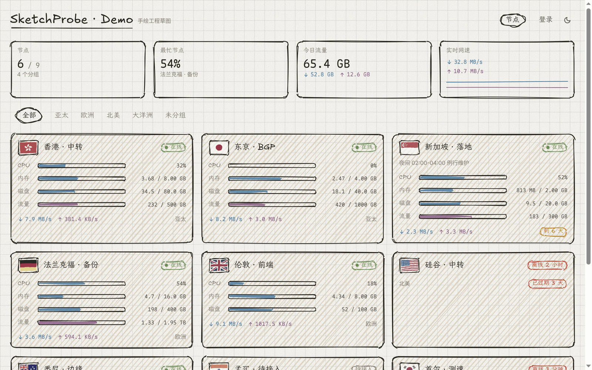
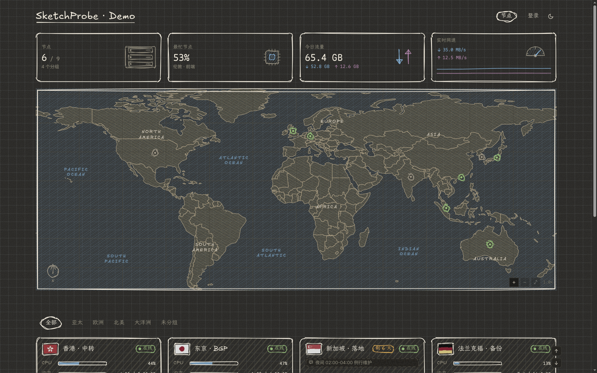

  

<h1 align="center">SketchProbe</h1>

  <strong><a href="https://github.com/monitor-probe/monitor">极简探针</a> 的手绘风格主题。</strong>

  可以查看服务器状态、资源使用情况、流量和网络延迟。 
  需要配合 <a href="https://github.com/monitor-probe/monitor">极简探针</a> 使用，不能单独运行。

  
  
  

  <a href="#界面预览">界面预览</a> · <a href="#主要特点">主要特点</a> · <a href="#页面能看什么">页面能看什么</a> · <a href="#技术与设计">技术与设计</a> · <a href="#安装方法">安装方法</a> · <a href="#主题设置">主题设置</a> · <a href="#许可">许可</a>

## 界面预览

支持浅色和深色，可以在页面右上角切换。

深色模式预览

## 主要特点

- **手绘边框与背景**：卡片外框、分割线为手绘线条，进度条、数值与图表仍为标准图形。
- **手绘世界地图**：显示各区域节点分布，支持随分组标签筛选。按节点设置的国家显示位置，同一国家的节点共用一个标记，未设置国家的节点不显示在地图上，地图缩放上限为 4 倍。
- **4 种底纹背景**：提供方格纸、点阵纸、横线纸和空白纸，可在后台切换。
- **手绘弯曲程度可调**：可在后台调整线条的弯曲程度（0 到 4 级）。
- **浅色与深色模式**：浅色为米白底色，深色为深灰底色。
- **实时刷新不抖动**：数据刷新时，边框线条保持固定，不会随数值变动而重新晃动。

## 页面能看什么

- **顶部汇总**：显示当前分组的节点数、最忙节点、今日流量以及实时网速。
- **节点列表卡片**：
  - 显示国旗、节点名称、在线状态与到期提示。
  - CPU、内存、磁盘使用率，以及设置了上限的月度流量进度。
  - 多线路网络延迟走势与实时数值。
  - 实时上下行网速、管理员公开备注。
- **节点详情页**：
  - 点击节点卡片进入详情，可查看 CPU 型号、系统与内核版本、虚拟化架构、探针版本。
  - 显示计费周期、价格、到期剩余天数与累计总流量。
  - 查看 CPU、内存、磁盘和网速的历史变化折线图，支持切换时间范围。

## 技术与设计

- **React、TypeScript、Vite**：分别用于页面组件、类型支持与项目构建。
- **Rough.js**：绘制卡片边框、分隔线等手绘线条。
- **Excalidraw**：界面参考了 Excalidraw 的手绘白板风格。
- **Nord**：配色参考了 Nord 的低饱和色彩风格，并针对纸张底色与深色模式做了适配。
- **Excalifont**：英文字母和数字使用的手写字体；中文使用访问设备上的本地字体，不同系统的显示效果可能略有差异。
- **country-flag-icons**：提供节点列表中的国旗图标。

## 安装方法

1. 登录 monitor hub 后台，进入「主题」页面。
2. 上传下载好的 `theme.tar.gz` 文件，或者粘贴主题 GitHub 链接。
3. 在主题列表里启用 SketchProbe。

## 主题设置

在 monitor hub 后台的「主题」设置中修改：

| 设置项 | 说明 | 默认值 | 可选范围 |
| --- | --- | --- | --- |
| **公告** | 页面顶部的提示文字，留空则不显示 | 空 | 文本 |
| **显示汇总** | 节点列表上方的四格汇总卡片开关 | 开启 | 开启 / 关闭 |
| **底纹** | 页面背景样式 | 方格纸 | 方格纸、点阵纸、横线纸、空白纸 |
| **手绘程度** | 线条的弯曲程度 | 2 | 0（最规整）~ 4（最潦草） |

## 许可

本项目采用 [MIT](LICENSE) 许可证开源。

随主题一起打包的第三方资源：

- [Excalifont](https://plus.excalidraw.com/excalifont) —— [SIL Open Font License 1.1](public/licenses/Excalifont-OFL.txt)
- [country-flag-icons](https://gitlab.com/catamphetamine/country-flag-icons) —— MIT（国旗）
- [rough.js](https://www.npmjs.com/package/roughjs) —— MIT（手绘线条，含 hachure-fill / path-data-parser / points-on-curve / points-on-path）
- [React](https://www.npmjs.com/package/react) / [react-dom](https://www.npmjs.com/package/react-dom) / [scheduler](https://www.npmjs.com/package/scheduler) —— MIT
- [Natural Earth](https://www.naturalearthdata.com/) —— 地图数据，公有领域

每个依赖的完整 MIT 许可文本见 [`public/licenses/THIRD-PARTY-NOTICES.txt`](public/licenses/THIRD-PARTY-NOTICES.txt)。
